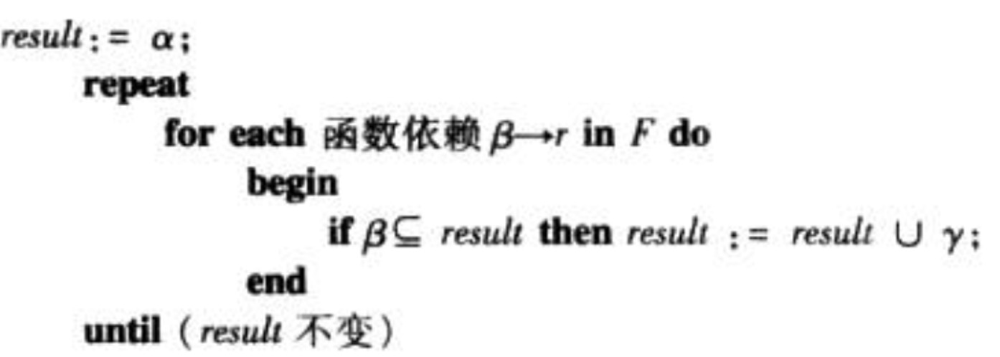
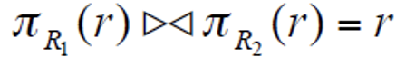
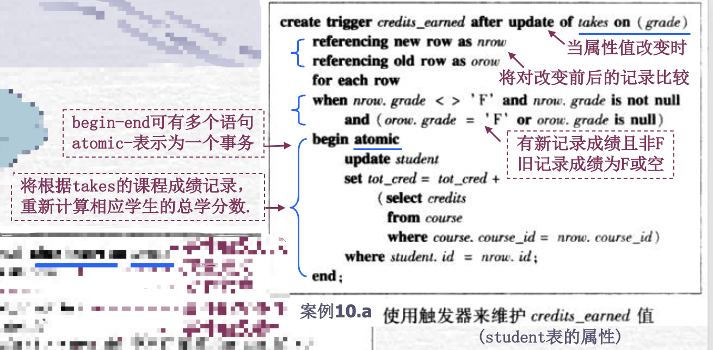

重庆大学计算机学院 ｜ 22Spring ｜ 数据库系统概论

# 数据库系统开发的主要过程

### Ⅰ 需求分析

- 功能需求 --> 功能需求说明书/ 用例图+时序图
- 数据需求 --> 数据需求说明书/ 用例图+时序图+数据流程图
	- 需求分析需要考虑应用功能和所设计的数据，包含数据库需求分析：仅仅考虑需要保存哪些数据
	- 核心任务：确定待保存的数据对象和它存在的关联。其他任务还有：数据约束、数据访问频率、数据访问安全、数据可靠性、数据响应效率，等，这些是保证数据库真正可用的关键。

### Ⅱ 系统设计

#### 1. 概念设计 --> ER模型

- **E-R模型的三个最基本的要素：**

	- **实体集**&**属性**(矩形)-描述数据对象及特征(内部结构)

		- **弱实体集特点**

			1) 没有键；

			2) 存在依赖于主实体集；

			3) 键由主实体集键和它的**分辨符**合并构成；

	- **联系集**(菱形&连线)-描述数据对象间联系(外部结构) --> 相关类型联系的集合

		- 双线：全部参与  (not null 非空约束)                                                                  

			单线：不是全部参与    

		- 【箭头看上限】                                                        

			没有箭头：多对多                                                   

			两边都有箭头：一对一                                            

			一边有一边没有箭头：一对多

- **复合属性&多值属性**

	- 将几个单值属性代替多值属性
	- 讲原来的多值属性用一个新的实体代替

- **多元联系集和角色**：多元联系的二元分解

- **特殊化和一般化（子实体集的继承）**

  - 特化：自顶向下的设计过程
  	- 重叠特化：双箭头
  	- 不相交特化：单箭头
  - 概化：自底向上的设计过程
  	- 部分概化:允许父实体不属于任何子实体集 (缺省表示) 
  	- 全部概化:每个父实体必属于某

- 聚集

	- 是一种抽象，将联系集看成一个更高层的抽象实体集

- **理论上讲：**E-R模型可描述任何复杂客观对象，实体集可以是任何一种复杂数据结构**因为：**E-R模型重点是**面向客观世界**，建立**易于用户理解**的抽象数据模型 (它不关心数据如何才能够被实际存储）

#### 2. 逻辑设计 --> 关系模式

- **数据模型**

	- 数据模型三个基本要素

	  > 是一个描述数据、数据联系、数据语义以及数据一致性约束的概念工具的集合

	  - 数据结构：创建数据库的规则
	  - 数据操作：对数据进行的操作类型
	  - 约束条件：一组数据完整性约束规则

	- 层次模型 -> 树🌲

		> 优点：
		> 数据模型比较简单，操作简单。    
		> 对于实体间联系是固定的，且预先定义好的应用系统，性能较高。
		> 提供良好的完整性支持。
		> 缺点：
		> 不适合于表示非层次性的联系。
		> 对插入和删除操作的限制比较多。
		> 查询子女结点必须通过双亲结点。

		- 利用“记录”和“双亲子女关系”来描述应用的数据结构
		- 非层次化结构的记录
			- 采用副本：带来数据冗余
			- 虚拟记录：指针操作增加开销
		- 定义物理存储结构
			- 邻接法
		- 定义基本数据操作
			- 查找给定条件的记录
			- 查找下一亲兄弟
			- ...

	- 网状模型 -> 图🗺️

		> 不同点：
		>
		> 它去掉了层次模型的两个限制：
		> 	允许多个结点没有双亲结点；
		> 	允许结点有多个双亲结点。
		> 它还允许两个结点之间有多种联系（复合联系）
		>
		> 优点：
		> 能够更为直接地描述现实世界。
		> 具有良好的性能，存取效率较高。
		> 缺点：
		> 其DDL语言极其复杂。
		> 数据独立性较差。由于实体间的联系本质上通过存取路径指示的，因此应用程序在访问数据时要指定存取路径。

		- 记录的表示
			- 记录、数据项
		- 存储结构
			- 链接法（采用指针链实现复杂数据类型）
		- 基本数据操作
			- Find
			- Get
			- ...

- **关系模型**

	- 结构
		- 关系名
		- 关系模式：属性
		- 关系：实例
	- 第一范式 1NF
		- 要求关系的属性具有原子性：如分量个数固定
	- 码与模式图
		- 主码：一个关系仅允许有唯一的主码，区分不同原组
		- 超码：是一个或多个属性的集合，这些属性可以让我们在一个实体集（所谓的实体集就是student表中多条记录的集合）中唯一地标识一个实体。如果K是一个超码，那么K的任意超集也是超码，也就是说如果K是超码，那么所有包含K的集合也是超码
		- 候选码：超码包括候选码，虽然超码可以唯一标识一个实体，但是可能大多数超码中含有多余的属性，所以我们需要候选码。若关系中的一个属性或属性组的值能够唯一地标识一个元组，且它的真子集不能唯一的标识一个元组，则称这个属性或属性组做候选码
		- 外键：通过一个表中的指定字段，可以把数据与另一个张表关联起来，这种列成为外键，作用：说明元祖联系，保证数据有效性
		- 模式图：描述数据对象的内部结构、特征和相互关联、以及对象间的关联

- **关系运算**

	> 过程化的查询语言

	- 基本关系运算
		- 【包括并(∪)、差(-)、广义笛卡尔积(×)、投影(π，垂直分解)和选择(σ，水平方向抽取元祖)，重命名（ρ）】，
	- 附加运算
		- 交、自然连接（⋈，元祖按属性值相同粘贴），赋值运算（<-），外连接运算（outer join，左，右，全）
	- 扩展的关系代数运算
		- 广义投影运算（允许属性表达式）
		- 聚集函数$g_(sum), g_(avg),g_(min),g_(max),g_(count)$

- E-R图到关系模式的转换

	- 实体集的转换

		- 简单实体集的转换->新的关系模式:  属性集与主码，就是实体集的属性集与主码
		- 弱实体集的转换->新的关系模式:  1)属性集:弱实体集的属性集+主实体集的主码  2)主码:主实体集的主码+弱实体集的分辩符  
		- 复杂实体集的转换->新的关系模式(1NF):  1)属性集:包含实体集的所有简单属性，此外    其复杂属性需逐层展开变换为多个简单属性  2)主码:需根据唯一确定元组特征来确定  

	- 联系集的转换

		- 一对一联系->新的关系模式:  属性集:两方主码+联系的属性  ;主码：任一方的主码均可
		- 多对一联系->新的关系模式:  属性集:两方主码+联系的属性;主码:多方主码  
		- 多对多联系->新的关系模式:  属性集:两方主码+联系的属性;主码:两方主码

		> 🤓总结：一对多（及一对一）联系都不需要单独增加关系模式，只需要在多方实体集中添加一方主码和联系的属性即可  
		>
		> 1:M  -> 1 方主键出现在M方成为外键  1:1  -> 任意一方主键出现在另一方中，成外键  
		>
		> M：N -> 联系建为一新表，其主键由两个父实体的主键复合组成  

- 数据完整性设计 -> 关系模型的完整性约束

	- 概要

		- 定义：对关系的某种约束条件
		- 目的：在于保证关系数据库中数据的正确性和可靠性

	- 类型

		- 实体完整性规则：在任何关系的任何一个元组中，主键的值不能为空值、也不能取重复的值 -> 保证每一个元祖都是唯一的

			```sql
			primary key ...
			```

			

		- 域完整性规则（用户定义完整性规则）：根据实际情况，定义表中属性的取值范围 -> 用于保证给定字段的数据有效性

		- 参照完整性规则（引用完整性规则）：不允许一个关系中引用另一个关系中不存在的元祖 -> 用于确保相关联的表间数据保持一致

			```sql
			foreign key ... references ...
				on delete cascade # 不写时拒绝删除
				on update cascade # 连带删除（修改）
				set null/ default # 设置为空/ 默认值
			```

	- 其他

		- 断言:当数据更新时，保持谓词为真, (否则拒绝更新)

			```sql
			create assertion <assertion-name> check <predicate>;
			```

		- 表上的授权：通过授权管理用户访问权限

			```sql
			grant insert on instructor to public
			revoke select on branch from public
			create role instructor
			grant instructor to Amy
			```

			

- 数据库结构优化设计

	- 异常

	- 冗余

		> 由于完整性约束而存在（函数依赖：x -> y：y依赖x）

		-> 模式优化：模式分解

		- 函数依赖

			- A->B ：B依赖A <-> A一致，B结果一致

				A 1122

				B 1111

				C 2332

			- AC -> B 也恒成立 （因为结论为真即使假设为假也成立）

	- 模式优化

		> 如果一个关系满足一种范式(BCNF, 3NF 等.)，就能判断该关系模式是否避免了某类问题。这样就能知道该关系是否需要分解。 -> 分解关系模式

		- 第一范式 (1NF)
			- **每个属性都是原子属性**
			- 本质上所有关系都满足第一范式
		- 第二范式 (2NF)
			- 任何满足第二范式的关系满足第一范式
			- **所有非主属性必须依赖于整个主码而不能依赖于主码的部分属性**
		- Boyce-Codd 范式(BCNF)
			- 任何符合BCNF的关系也符合 2NF
		-  三范式(3NF)
			- 任何符合BCNF的关系也符合 3NF 

	- 函数依赖

		- 函数依赖理论

			- Armstrong 公理 (X, Y, Z 是属性集):

				- Reflexivity （自反律）: 	 

					If X ⊇ Y, then X → Y

				- Augmentation （增广律）: 	If X → Y, then XZ → YZ  for any Z

				- Transitivity （传递律）: 	

					If X → Y and Y → Z, then X → Z

			- 由Amstrong导出的推导规则

				- 合并律(union rule) 

					若X -> Y，X -> Z，则X -> YZ 

				- 分解律(decomposition rule) 若X  ->  YZ ，则X  -> Y，X ->  Z

				- 伪传递律(pseudotransitivity rule) 

					若X -> Y，WY  -> Z，则WX -> Z

		- 键

			给定 R(A, B, C).   

			- A→ABC 意味着A 是一个键（码）
			-   X → R 意味着 X 是一个超键

		- 函数依赖集的闭包：由F逻辑蕴含的所有函数依赖的集合

			> 过于复杂

		- 属性集闭包

			- 计算

				

			- 例子🌰

				F = {A → B, B → C, C D → E } ，  A →E是否成立?  

				也就是, 判断 A → E 是否在 F+中?        等价于, E 是否在A+中? 

				Step 1: Result = A  

				Step 2: 考虑A → B, Result = AB     考虑B → C, Result = ABC     考虑CD → E, CD 不在ABC, 不添加  

				Step 3: A+ = {ABC}   E 不在A+中,所以 A → E 不在F+中  

			- 作用

				- 测试超键X：计算X+是否包括R的全部属性
				- 检测函数依赖x -> y是否成立：判断是否 Y⊆ X+
				- 计算F的函数依赖集闭包 

	- 分解模式

		- Issue

			- 查询代价变高
			- 重新构建分解前的实例
			- 检查某些以来需考虑分解后的多个关系

		- 无损连接分解

			> 将R 分解为 R1 和R2 ，如果是无损连接分解，那么应该满足：  
			>
			> 

			- 将R分解为R1， R2，若R1交R2 -> R1或R2，则无损
			- 将R 分解为(UV) 和(R-V)，如果U → V 在R上成立，那么分解是无损连接分解

		- ⚠️：保持函数依赖并不能保证无损连接分解，反之亦然

		- 判断两个函数依赖集是否等价：检查属性集闭包F1+ 是否= F2+

- 数据安全设计

- 物理设计 --> 建立物理存储模型

### Ⅲ 系统实现

- 数据库实现

- 应用开发 --> SQL

	<a>https://www.w3school.com.cn/sql/index.asp</a>

	- 创建数据库实例

	- 定义数据结构

		> 定义属性特征 + 说明语义约束

		```sql
		create table instructor
		(
		    ID varchar(5),
		    name varchar(20) not null,
		    dept_name carchar(20),
		    salary numeric(8,2),
		    primary key(ID),
		    foreign key(dept_name) reference department
		    );
		```

	- 基本关系运算的SQL实现

		```sql
		Select name   # 投影
		From instructor, department  # 自然连接
		Where dept_name = 'Comp.Sci' and salary > 70000;  # 选择
		```

		对应关系运算：
		$$
		Π_{name}(σ_{dept\_name='Comp.Sci'\  and\ salaty>70000}(instuctor X department))
		$$

		- Union -> 并
		- Except -> 差
		- Intersect -> 交

	- 聚集函数的SQL实现

		> *代表选择所有属性

		```sql
		select avg (salary) as avg_salary
		from instructor
		where dept_name= 'Comp. Sci.';
		
		```

		$$
		g_{avg (salary)}(σ_{dept\_name='Comp. Sci.'}(instuctor))  
		$$

		-> 计算一个系的平均工资

		```sql
		select count (distinct ID)
		from teachers
		where semester ='Spring' and year=2010;
		```

		-> 计数前去除重复数组

		```sql
		select dept_name, avg (salary) # 平均工资的部门名
		from instructor
		group by dept_name # 指定计算范围（分组）
		having avg (salary) > 42000; # 结果筛选
		```

	- SQL嵌套子查询

		```sql
		select dept_name, avg (salary)
		from instructor
		group by dept_name
		having avg (salary) > 42000;
		```

		-> 找出在2009年秋季，但不在2010年春季同时开课的所有课程

		```sql
		select course_id
		from section as S
		where semester=‘Fall'  and year=2009 and
		exist (select *
		       from section as T
		       where semester='Sring' amd   year=2010 and
			S.course_id=T.course_id);
		
		```

		-> 找出在2009年秋季和2010年春季同时开课的所有课程 

	- SQL数据操纵语言DML

		```sql
		delete from instructor
		where dept_name='Finance'
		```

		-> 删除

		```sql
		insert into cource(course_id, title, dept_name, credits)
		values('CS-437', 'Database systems', 'Comp.Sci', 4)
		```

		-> 插入

		```sql
		update instructor
		set salary = salary * 1.03
		where salary > 100000;
		```

		-> 更新

	- SQL支持的表间连接方式

		```SQL
		# 允许按照指定属性（可不同名连接），且连接表中连接属性都会出现
		select name, course_id
		from instructor, teaches
		where instructor.ID= teaches.ID;
		
		# 按两表同名属性连接
		select name, course_id
		from instructor natural join teaches
		
		# 允许按照指定属性连接
		select name, title
		from (instructor natural join teaches) 
		join course using(course_id);
		
		# 作用及查询结果表都相同，在连接表中连接属性都会出现(ID重复出现两次)
		select *
		from student, takes
		where student.ID = takes.ID;
		
		# 只出现一次ID
		select *
		from student join takes on student.id=takes.id; 
		```

	- 视图

	- SQL函数

		> SQL除了提供一些常用的内建函数(聚集、日期、字符串转换等)外，  可编写存储过程(业务逻辑)并存于库中, 可在SQL/应用代码中调用

		```sql
		create function dept_count(dept_name varchar(20))
		returns integer
		begin
			declare d_count integer;
			select count(*) into d_count
			from instructor
			where instructor.dept_name = dept_name
			return d_count;
		end
		```

	- SQL过程

		> 过程是一段SQL语句程序，而函数有处理和返回值

		```sql
		create procedure dept_count_proc(in dept_name carchar(20), out d_count integer)
		begin
			select count(*) into d_count
			from instructor
			where instructor.dept_name = dept_name
		end
		```

	- 外部语言过程

		> 外部语言过程：SQL允许用程序语言(Java,C#,C,C++)来定义函数或过程，
		> 运行效率要高于SQL中定义的函数，用于完成无法在SQL中执行的计算。

	- 触发器

		> 用于备份或复制数据库

		

	- 用户自定义的类型

### Ⅳ 系统运行和维护

- 运行系统
- 数据维护 --> 数据更新，结构修改，数据备份
- 数据分析 --> 数据仓库，数据挖掘