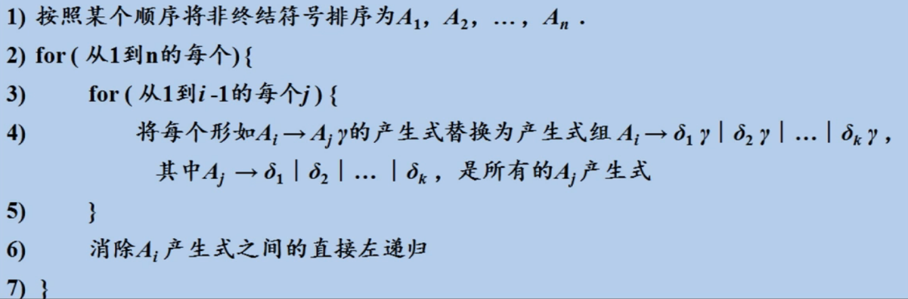
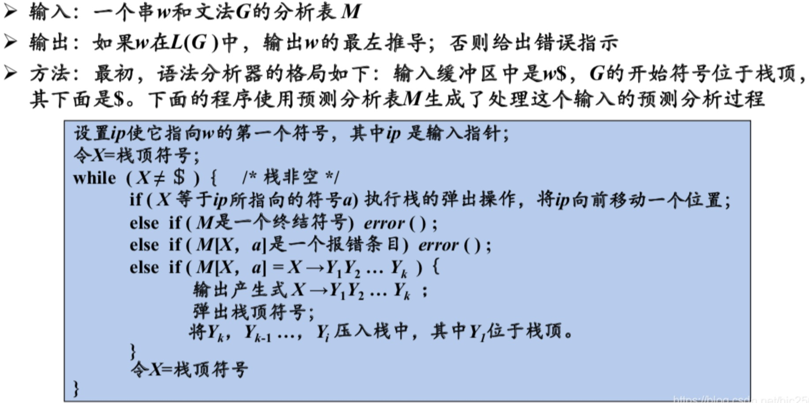

重庆大学计算机学院 ｜ 22Spring ｜ 编译原理

## 一. 词法分析

## 二. 语法分析

> 语法分析器使用词法分析器中生成的各个词法单元的第一个分量来创建树形的中间表示，利用其（多为语法树）给出词法单元流的语法结构

#### 语法树

每个内部节点代表一个运算，节点的子节点表示该运算的分量

## 三. 语义分析

> 使用语法树和符号表中的信息来检查源程序是否和语言定义的语义一致，同时也收集类型信息

### Ⅰ 相关概念

- 句型：S 推倒出 α，而S是文法G的开始符号，则α是G的句型
- 句子：不包含非终结符号的句型
- 语言：文法生成的所有句子的集合
- 上下文无关语言：可以由文法生成的语言
- 等价文法：两个文法生成相同的语言

### Ⅱ 上下文无关文法

> 文法描述了大多数程序设计语言构造的层次化语法模型。
>
> 一个上下文无关文法由：一个终结符号集合（小写字母，运算符，标点符，数字，黑体字符串）、一个非终结符号集合（大写字母，小写、斜体的名字，字母表排在后面的小写字母，小写的希腊字母）、一个产生式集合和一个指定的非终结符号为开始符号组成。

#### 1. 二义性

> 一个文法可以为某个句子生成多棵语法分析树 <--> 对同一个句子有多个最左推导或最右推导的文法

#### 2. 两种推导过程

- 最左推导 Leftmost Deviation
	- 总是选择每个句型的最左非终结符号，写作$lm$
- 最右推导 Rightmost Deviation（规范推导）
	- 总是选择最右边的非终结符号，写作$rm$

#### 3. 语法分析树的常用构造方法

- 自顶向下的
	- 从语法树的顶部（根结点）开始向底部（叶子结点）构造语法分析树
	- 不能应用于带左递归文法的语法分析
- 自底向上的
	- 从叶子结点开始向根结点方向扫描构造语法分析树
	- “最右”推导

### Ⅲ 设计文法

#### 1. 二义性的消除

- 中间的语句不能以一个尚未匹配的语句结尾 P134

#### 2. 左递归的消除

> 如果一个文法中有一个非终结符号A使得对某个串å存在一个推导：A -> Aα，则称这个文法有左递归

- 如何替换

	- 直接左递归
		$$
		A -> Aα | ß    \   替换为：   A -> ßA'     ;\         A' -> αA' | ε
		$$

	- 间接左递归

		方法类似

	- 无环左递归

		

#### 3. 左公因子的提取

> 一种文法转换方法，可以适用于预测分析技术或自顶向下分析技术的文法

- 对于产生式
	$$
	 A -> αβ_1 | αβ_2 | η 
	$$
	

- $$
	A -> αA | η';\ Α' -> β_1|β_2
	$$

	

#### 4. 非上下文无关语言的构造

> C、Java这种语言是非上下文无关的，因为都要求标识符先声明后使用，在这些语言的编译器中，标识符是否先声明后使用是在语义分析阶段检查的

### Ⅳ 自顶向下的语法分析

> 可以被看成为输入串构造语法分析树的问题：从根结点开始按照深度优先的场景语法分析树的各个节点（寻找最左推导过程）
>
> 🏆关键：确定对一个非终结符号应用哪一个产生式

#### 1. 递归下降的语法分析

> 由一组过程组成，每个非终结符号有一个对应的过程，程序的执行从开始符号对应的过程开始，如果这个过程的过程体扫描了整个输入串，他就停止并宣布语法分析完成

- 通用的递归下降分析可能需要回溯：最初选择产生式的时候不确定
- 左递归的文法会使递归下降的语法分析器进入一个无限循环♾️

#### 2. First 和 Follow

> First(α) ：可从**α推导得到的串的首符号集合**，其中α是任意的文法符号串，该集合中可包含ε
>
> Follow(A)：对于非终结符号A，该集合被定义为可能在**某些句型中紧跟在A右边的终结符号的集合**，可包括$（结束标记）

- 计算**各个文法符号X的First(X)规则**：不断应用该规则，直至没有新的终结符号或ε可以被加入到任何的First集合中为止

	- 如果X是一个终结符号，那么First(X) = X
	- 如果X是一个非终结符号，且$X -> Y_1Y_2...Y_k$是一个产生式，k≥1，那么对于某个i，a在Firtst($Y_i$)中且ε在所有的First($Y_1$), First($Y_2$), ..., First($Y_(i-1)$)中，那么就把a加入First(X)
	- 如果$X->ε$是一个产生式，那么将ε加入到First(X)中

- 计算**串$X_1X_2...X_k$的First(X)规则**：

	- 加入F($X_1$)的所有非ε符号，若ε在F($X_1$)中，则加入F($X_2$)的所有非ε符号，以此类推，若所有的i，ε都在First($X_i$)中，则加入ε

- 计算所有**非终结符号A的Follow(A)集合的规则**：不断应用该规则，直到没有新的终结符号可以被加入到任意Follow集合中为止

	> 🥹 注意记录Follow(x) 是在哪个Follow(y)里，这样循环的时候好发现

	- 将$（输入右端的结束标记） 放到Follow(S)中，其中S是开始符号
	- 如果存在一个产生式$A->αBβ$，那么First(β)中出了ε之外的所有符号都在Follow(B)中
	- 如果存在一个产生式$A->αB$，或$A->αBβ$，且First(β)包含ε，那么Follow(A)中的所有符号都在Follow(B)中

#### 3. LL(1)文法

> 可以通过该文法构造出预测分析器（无需回溯的递归下降语法分析器）
>
> 第一个“L”表示从左向右扫描输入，第二个“L”表示产生最左推导，“1”表示在每一步中只需要向前看一个输入符号来决定语法分析的动作
>
> 该文法足以描述大部分程序设计语言构造，但注意⚠️：左递归的文法和二义性的文法都不可能是LL(1)的

- **判断文法G是否为LL(1)的**，当且仅当G的任意两个产生式$A->α | β$满足下面的条件：
	- ① FIRST(α)和FIRST(β)是不相交的集合
		- 不存在终结符号a使得α和β都能够推导出以a开头的串
		- α和β中最多只有一个可以推导出空串
	- ② 如果ε在FIRST(β)中，那么 FIRST(α)和FOLLOW(A)是不想交的集合；在FIRST(α)中亦然
		- β能推出空，那么α不能推导出任何以Follow(A)中某个终结符号开头的串；α亦然

- 构建**预测分析表**的算法

	> ⚠️注意：细节如：｜的处理
	>
	> 如果该文法存在左递归或者二义性，那么分析表M至少会包含一个多重定义的条目

	- 对于文法G的每个产生式 $A->α$，进行如下处理：
		- 对于FIRST(α)中的每个终结符号a，将$A->α$ 加入M[A,a]中
		- 如果ε在FIRST(α)中，那么对于FOLLOW(A)中的每个终结符号b，将$A->α$加入到M[A,b]中。如果ε在FIRST(α)中，且\$在FOLLOW(A)中，也将$A->α$加入到M[A,$]中
		- 完成以上操作后，如果M[A,a]中没有产生式，则将其设置为error（或空条目）

#### 4. 非递归的预测分析

> [非递归](https://so.csdn.net/so/search?q=非递归&spm=1001.2101.3001.7020)的预测分析**不需要**为每个非终结符**编写递归下降过 程**，而是根据预测分析表构造一个**自动机**，也叫**表驱动的预测分析。**即增加一个栈，来**增强自动机的识别能力**

- 表驱动的预测语法分析

	https://www.bilibili.com/video/BV1zW411t7YE?p=24

	

#### 5. 预测分析的错误恢复

- 错误恢复策略
	- 恐慌模式
	
		恐慌模式的恢复：语法分析器一旦发现错误就不断丢弃输入中的符号，知道找到同步词法单元集合中的某个元素
	
		- 同步集合的选取：
			- 将Follow(A)中的所有符号放到非终结符号A的同步集合中
			- 把较高层构造的开始符号加入到较低层构造的同步集合中去
			- 把First(A)中的符号加入到非终结符号A的同步集合中去
			- ... P146
	
	- 短语层次恢复
	
		短语层次的恢复：在余下的输入上进行局部性纠正
	
	- 其他
	
		- 错误产生式
	
		- 全局纠正
	
			

